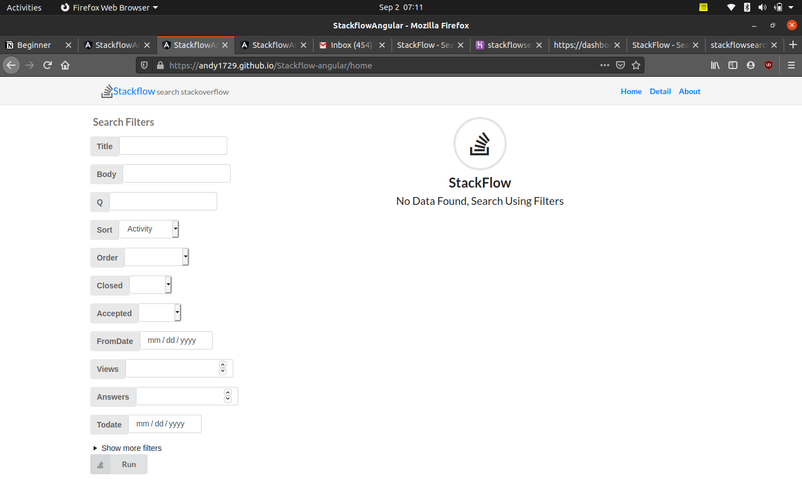

# StackflowAngular

  <h1>Stackflow </h1>
  

 
 
Live at : https://andy1729.github.io/Stackflow-angular

Django version of same app : https://github.com/andy1729/Stackflow

This project was generated with [Angular CLI](https://github.com/angular/angular-cli) version 10.0.8.

## Project Story

I built this as an assignment I received for an interview process

### Assignment Statement
Please build an Application over StackOverflowAPI for searching questions in Stack Overflow (ref: https://api.stackexchange.com/docs/advanced-search)

**Requirement**
- [x] Should be able to search all available fields/parameters. 
- [x] List the result with pagination with AngularJS.
- [x] Design the page for listing and detail page according to current standards
- [x] Minimal third-party plugins

## Screenshots

**Empty View**

**Pagination**

**Details Page**

**About Page**

   
## Development server

Run `ng serve` for a dev server. Navigate to `http://localhost:4200/`. The app will automatically reload if you change any of the source files.

## Code scaffolding

Run `ng generate component component-name` to generate a new component. You can also use `ng generate directive|pipe|service|class|guard|interface|enum|module`.

## Build

Run `ng build` to build the project. The build artifacts will be stored in the `dist/` directory. Use the `--prod` flag for a production build.

## Running unit tests

Run `ng test` to execute the unit tests via [Karma](https://karma-runner.github.io).

## Running end-to-end tests

Run `ng e2e` to execute the end-to-end tests via [Protractor](http://www.protractortest.org/).

## Further help

To get more help on the Angular CLI use `ng help` or go check out the [Angular CLI README](https://github.com/angular/angular-cli/blob/master/README.md).
